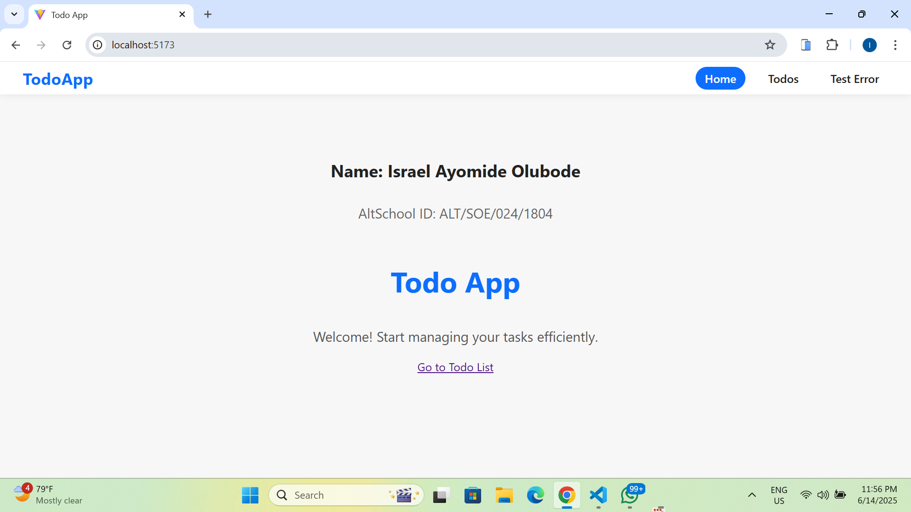
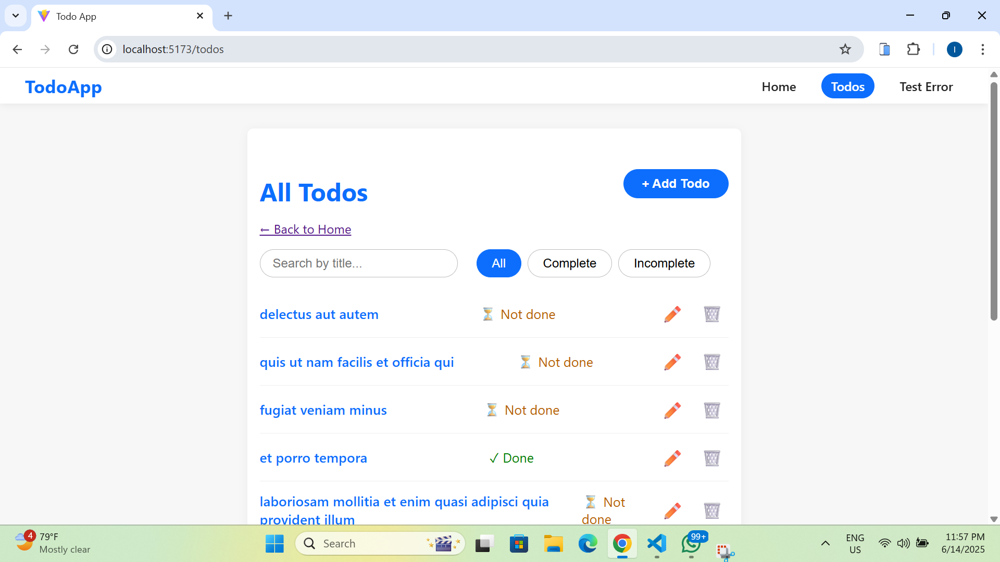
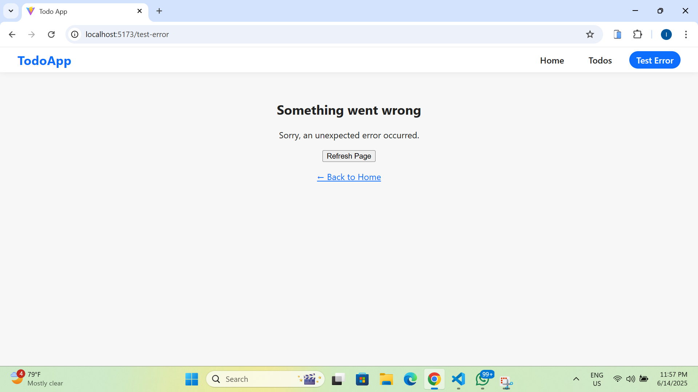
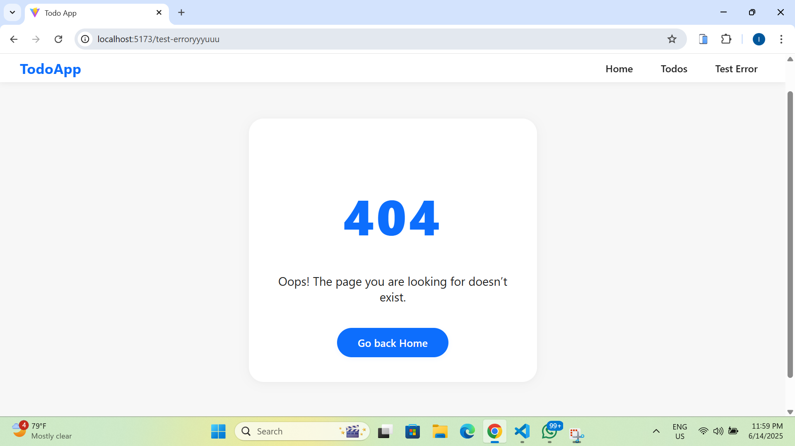
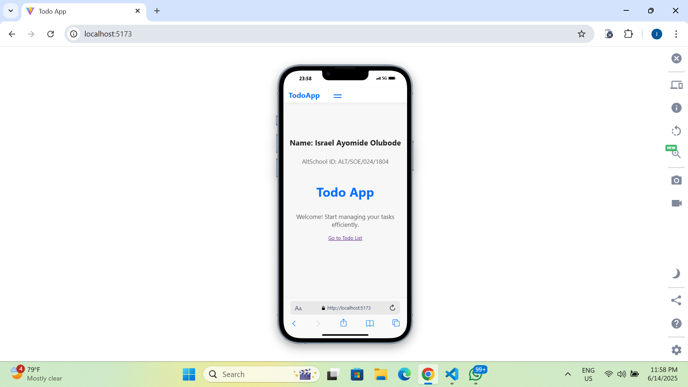
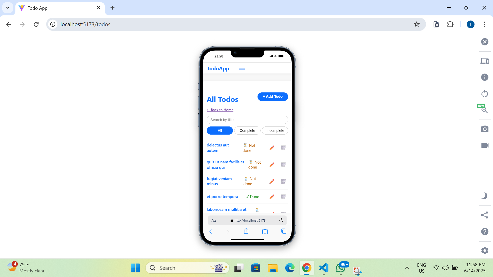
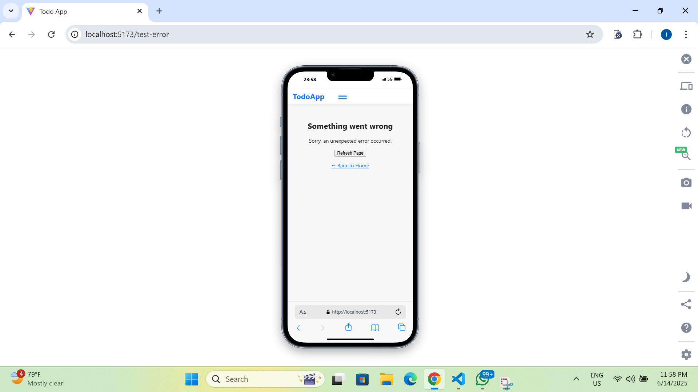
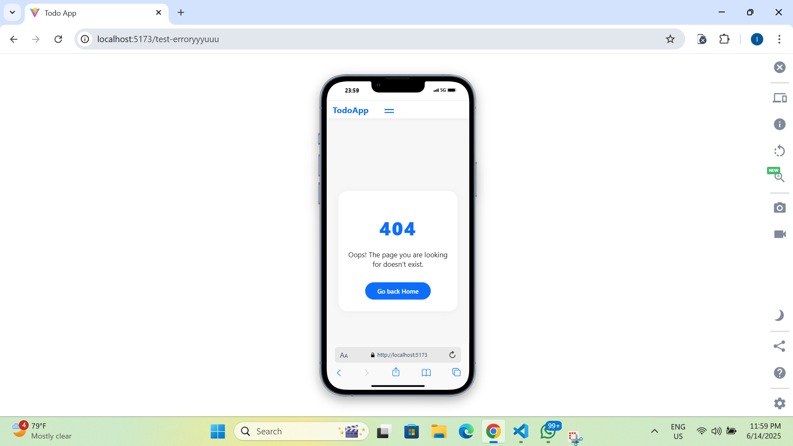

# AltSchool Todo App – Second Semester Exam Submission

##  Project Overview

This project is a **comprehensive Todo application** built for the AltSchool of Engineering Second Semester Frontend Exam. It demonstrates robust API integration, modern React patterns, accessibility best practices, and a strong focus on professional UI/UX.

**Live Demo:** [https://altschool-todo-app.netlify.app/]  
**Repository:** [https://github.com/Israelayo/altschool-todo-app]

---

##  Features

- **API-Based Todo Listing**: Fetches todos from JSONPlaceholder with client-side pagination (10 per page).
- **Todo Detail Page**: View details of any todo via nested routing.
- **CRUD Operations**: Add, edit, and delete todos. Edits and deletions persist for both API-fetched and user-created todos using localStorage.
- **Search & Filter**: Search todos by title and filter by completion status (all/complete/incomplete).
- **Pagination Controls**: Intuitive navigation through todo pages.
- **Error Handling**: Custom ErrorBoundary component and a dedicated 404 Not Found page.
- **Responsive Design**: Mobile-first and works seamlessly on all screen sizes.
- **Accessible UI**: Uses semantic HTML, ARIA attributes, keyboard navigation, and proper color contrast.
- **Persistent Caching**: API responses (and user changes) are cached with localStorage for offline resilience.
- **Loading States**: Smooth loading indicators for all API activity.
- **Professional Styling**: Consistent color scheme and clean, modern appearance.

---

##  Technology Stack

- **React 19+** (Functional components and hooks)
- **Vite** (for blazing-fast development)
- **React Router v7** (for navigation)
- **@tanstack/react-query** (for data fetching and caching)
- **Vanilla CSS** (with BEM methodology for maintainability)
- **Other Tools**: Custom localStorage utility, optional ARIA helpers

---

##  Architecture & Design Decisions

- **Component Structure**:  
  - `src/pages/`: Page-level components (home, list, detail, error, not found)
  - `src/components/`: Reusable UI elements (Navbar, Modal, ErrorBoundary)
  - `src/utils/`: Utility modules (localStorage overrides)
- **State Management**:  
  - API state managed via `@tanstack/react-query`
  - Local state for user-created or overridden todos
- **Persistence**:  
  - All edits and deletions (even for API todos) are stored in `localStorage` for a true CRUD-like experience.
- **Routing**:  
  - Every todo has its own detail route (`/todos/:id`)
  - 404 handling for undefined routes
- **Accessibility**:  
  - Semantic HTML, ARIA roles/labels and focus management.

---

##  API Usage

Todos are fetched from [JSONPlaceholder](https://jsonplaceholder.typicode.com):

- `GET /todos` – List all todos
- `GET /todos/{id}` – Get a single todo
- `POST /todos` – Create a new todo (local only)
- `PUT /todos/{id}` – Edit a todo (local only)
- `DELETE /todos/{id}` – Delete a todo (local only)

> **Note:** Since JSONPlaceholder is a mock API, POST/PUT/DELETE actions are handled locally via `localStorage` for a realistic experience.

---

##  Installation & Setup

**Prerequisites:**  
- Node.js (v18+ recommended)
- npm (v9+) or yarn or pnpm

**Clone and Run Locally:**
```bash
git clone []
cd altschool-todo-app
npm install
npm run dev
```
Visit [http://localhost:5173](http://localhost:5173) in your browser.

**Available Scripts:**
- `npm run dev` – Start development server
- `npm run build` – Build for production
- `npm run preview` – Preview production build
- `npm run lint` – Lint the codebase

---

##  Folder Structure
```
altschool-todo-app/
├── src/
│   ├── components/
│   ├── pages/
│   ├── routes/
│   ├── styles/
│   ├── utils/
│   ├── App.jsx
│   └── main.jsx
├── .gitignore
├── package.json
└── README.md
```

---

##  Screenshots










---

##  Future Improvements

- Add IndexedDB/Dexie.js for robust offline support.
- Integrate real API backend for full CRUD.
- User authentication and multi-user support.
- Unit and integration test coverage.
- Dark mode and theme switcher.

---

##  Exam & Project Requirements Checklist

- [x] Fetch and display todos with pagination
- [x] Todo detail route with back navigation
- [x] Add/edit/delete todos (CRUD)
- [x] Local persistence for all changes
- [x] Search and filter by status/title
- [x] Error boundary and custom 404 page
- [x] Consistent, professional, accessible UI
- [x] Responsive (mobile-first) design
- [x] Semantic HTML and ARIA compliance
- [x] Custom loading and empty states
- [x] README with all required sections

---

##  Development & Deployment

- **Repository:** Private on GitHub, with proper `.gitignore` and `package.json`
- **Commit Messages:** Clear and descriptive
- **Collaborator:** @Oluwasetemi added
- **Deployment:** Hosted on [Netlify] – see [Live Demo](https://altschool-todo-app.netlify.app/)

---

##  Tips & Acknowledgements

- Designed for AltSchool’s Second Semester Frontend Exam
- Special thanks to God, my instructor (Mr Oluwasetemi) and the entire AltSchool team.

